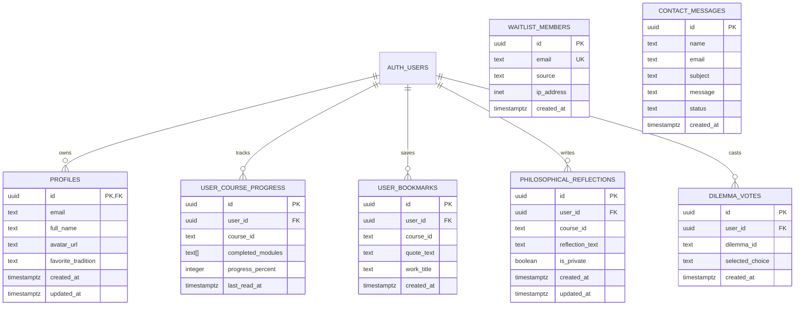

# 🏛️ Western Philosophy Academy — System Architecture

> **Document Version**: 2.0.0-PROD  
> **Status**: Production Blueprint  
> **Role / Perspective**: Lead Senior Backend & Systems Architect  
> **Target Scale**: 100k+ MAU, Sub-100ms TTFB, 99.95% Availability  

---

## 1. Executive Summary & Philosophy

Western Philosophy Academy is a high-performance educational platform designed with an **immutable-first, hybrid-edge architecture**. Philosophical treatises and timeless historical doctrines are inherently static; user reflections, dilemma votes, course completions, and personal bookmarks are dynamic. 

The architecture separates concerns into:
1. **Static / Read-Optimized Layer**: ISR (Incremental Static Regeneration) and Edge CDN caching for course treatises, timelines, and philosopher biographies.
2. **Dynamic / Write-Optimized BaaS Layer**: PostgreSQL managed by Supabase, hardened with Row-Level Security (RLS), parameterized stored procedures, and PgBouncer/Supavisor connection pooling.
3. **Application Server & Security Shield**: Next.js 16 (App Router) on Node.js 20, enforcing input validation (Zod), edge rate-limiting, and cryptographic session validation.

```
                              ┌────────────────────────┐
                              │     CLIENT BROWSER     │
                              │ (Desktop / Mobile PWA) │
                              └───────────┬────────────┘
                                          │
                            HTTPS / TLS 1.3 | HTTP/2
                                          │
                                          ▼
                              ┌────────────────────────┐
                              │  EDGE CDN & WAF LAYER  │
                              │   (Vercel / Cloudflare)│
                              └───────────┬────────────┘
                                          │
                    ┌─────────────────────┴─────────────────────┐
                    │                                           │
         [Static Content / ISR]                      [Dynamic API & Actions]
                    │                                           │
                    ▼                                           ▼
      ┌───────────────────────────┐               ┌───────────────────────────┐
      │   Next.js Edge Caching    │               │  Next.js Server Actions   │
      │  (Static Pages / Assets)  │               │    & API Route Handlers   │
      └───────────────────────────┘               └─────────────┬─────────────┘
                                                                │
                                              Zod Validation / Rate Limiting
                                                                │
                                                                ▼
                                                  ┌───────────────────────────┐
                                                  │    Supabase PostgREST     │
                                                  │    & Connection Pooler    │
                                                  └─────────────┬─────────────┘
                                                                │
                                               JWT Validation / FORCE RLS
                                                                │
                                                                ▼
                                                  ┌───────────────────────────┐
                                                  │ PostgreSQL 16 (Supabase)  │
                                                  │  - Multi-tenant RLS       │
                                                  │  - Parameterized Queries  │
                                                  │  - B-Tree Clustered Idx   │
                                                  └───────────────────────────┘
```

---

## 2. High-Level Component Architecture

| Layer | Technology | Primary Responsibilities |
| :--- | :--- | :--- |
| **Edge & CDN** | Vercel Edge / Cloudflare | Global CDN caching, SSL termination, DDoS protection, Bot filtering. |
| **Application Layer** | Next.js 16 (React 19, Node 20) | Server Components (RSC), Server Actions, Route Handlers, Auth cookie exchange. |
| **Validation Layer** | Zod v3 | Server-side schema validation, type narrowing, payload sanitization. |
| **Authentication** | Supabase Auth (GoTrue) | OAuth (Google, GitHub), Magic Links, cryptographically signed JWT cookies via `@supabase/ssr`. |
| **Persistence (RDBMS)** | PostgreSQL 16 (Supabase) | Multi-tenant user state, course progress, reflections, dilemmas, bookmarks, audit logs. |
| **Connection Pooling** | Supavisor (Port 6543) | Transaction-mode connection pooling to handle concurrent traffic spikes without DB thread exhaustion. |
| **State Caching** | Next.js Cache & Upstash Redis | Cache-tagging (`unstable_cache`), Rate-limiting token bucket, aggregate metric caches. |
| **Monitoring & Telemetry**| Health Endpoint & Sentry | `/api/health` heartbeat check, APM latency tracking, exception captures. |

---

## 3. Database Architecture & ERD (Entity-Relationship Diagram)

The database follows a normalized relational structure enforcing **Zero-Trust Multi-Tenancy** through PostgreSQL `FORCE RLS`.



### Table Specifications & Partitioning Strategies

1. **`public.profiles`**: Synchronized automatically with `auth.users` via a hardened `SECURITY DEFINER` trigger with `SET search_path = public, pg_temp`.
2. **`public.user_course_progress`**: 
   - Composite unique index on `(user_id, course_id)`.
   - Array cardinality constraint (`cardinality(completed_modules) <= 100`) preventing memory allocation exploits.
   - Progress percentage constraint (`0 <= progress_percent <= 100`).
3. **`public.dilemma_votes`**: 
   - Composite unique constraint `(user_id, dilemma_id)` guarantees one person = one vote.
   - Triggers or cached views compute community aggregates without re-scanning historical tables.
4. **`public.contact_messages` & `public.waitlist_members`**:
   - Write-only policies for public clients (cannot be queried or scraped by anonymous actors).
   - Regex validation on email format at the database engine level.

---

## 4. Security Architecture (Military-Grade Defense in Depth)

### 4.1. Row Level Security (RLS) Matrix

| Table | Anonymous (Anon) | Authenticated User | Admin / Service Role |
| :--- | :--- | :--- | :--- |
| `profiles` | SELECT (Public profile fields) | SELECT, UPDATE (Own row: `auth.uid() = id`) | ALL |
| `user_course_progress` | NONE | ALL (Own rows: `auth.uid() = user_id`) | ALL |
| `user_bookmarks` | NONE | ALL (Own rows: `auth.uid() = user_id`) | ALL |
| `philosophical_reflections`| SELECT (Only if `is_private = false`) | ALL (Own rows: `auth.uid() = user_id`) | ALL |
| `dilemma_votes` | SELECT (Aggregates only) | INSERT, SELECT (Own vote) | ALL |
| `waitlist_members` | INSERT (Validated) | INSERT | ALL |
| `contact_messages` | INSERT (Validated) | INSERT | ALL |

### 4.2. Anti-Exploit Checklist
1. **SQL Injection Proof**: PostgREST maps REST calls strictly to parameterized prepared statements. No raw dynamic string concatenation is allowed.
2. **Search Path Hijack Protection**: All stored procedures (`handle_new_user`, etc.) enforce `SET search_path = public, pg_temp` to prevent malicious schema injection.
3. **Buffer-Overflow & DoS Caps**:
   - `reflection_text`: 5,000 characters cap.
   - `message` (contact): 2,000 characters cap.
   - `course_id` / `dilemma_id`: Regex match `^[a-z0-9_-]{1,50}$`.
4. **Credential Isolation**:
   - `NEXT_PUBLIC_SUPABASE_URL` and `NEXT_PUBLIC_SUPABASE_ANON_KEY` are safe for public bundle.
   - `SUPABASE_SERVICE_ROLE_KEY` is **strictly restricted** to backend server runtime (never exposed to browser).

---

## 5. API Layer Design & Data Flow

### 5.1. Server Actions vs Route Handlers

```
┌────────────────────────────────────────────────────────────────────────┐
│                        NEXT.JS 16 APIS                                 │
├───────────────────────────────────┬────────────────────────────────────┤
│         SERVER ACTIONS            │          ROUTE HANDLERS            │
│   (Form & Mutation Intensive)     │   (External / Hook / System)       │
├───────────────────────────────────┼────────────────────────────────────┤
│ • Submit Course Progress          │ • /api/auth/callback (OAuth code)  │
│ • Save / Toggle Bookmark          │ • /api/health (Uptime & DB Ping)   │
│ • Post Philosophical Reflection   │ • /api/contact (Public Form Post)  │
│ • Cast Dilemma Vote               │ • /api/waitlist (Public Lead Post) │
│ • Update User Profile             │ • /api/metrics (Internal APM)      │
└───────────────────────────────────┴────────────────────────────────────┘
```

### 5.2. Standard Request-Response Contract
All server-side endpoints adhere to a unified JSON contract:

```typescript
// Standard API Envelope
export type ApiResponse<T> = 
  | { success: true; data: T; error: null; timestamp: string }
  | { success: false; data: null; error: { code: string; message: string; details?: unknown }; timestamp: string };
```

---

## 6. Observability, Caching & Performance Budgets

1. **Performance SLA**:
   - Static Page TTFB: `< 50ms` (served from CDN Edge).
   - Authenticated API Latency (p95): `< 150ms`.
   - Database Connection Pool: Max connection threshold 80% with circuit-breaker fallback.
2. **Cache Invalidation Strategy**:
   - Course Treatises & Historical Data: `stale-while-revalidate = 86400` (24 hours).
   - On Course Content Update: `revalidateTag('courses')`.
3. **Health Check Pipeline**:
   - `/api/health`: Executes a lightweight query (`SELECT 1`) against Supabase and returns system uptime, memory usage, and DB latency.
