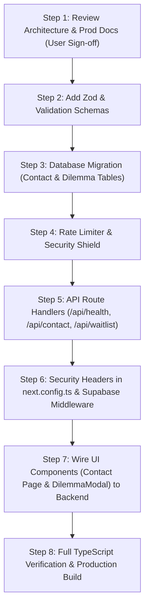

# 🗺️ Western Philosophy Academy — Senior Backend Engineering Roadmap

> **Document Version**: 2.0.0-PROD  
> **Status**: Strategic Execution Plan  
> **Execution Strategy**: Phased implementation, zero-downtime, fully backward compatible  

---

## 1. Overview & Current Gap Analysis

As a Senior Backend Developer assessing the current codebase:

| Capability | Current State | Production Target | Priority |
| :--- | :--- | :--- | :--- |
| **Database Schema** | 5 tables in a single `schema.sql` file | Versioned migrations (`supabase/migrations/`), plus `contact_messages` & `dilemma_votes` tables | **Phase 1** |
| **Input Validation** | Ad-hoc manual regex checks | Strict runtime schema validation using **Zod** across all payloads | **Phase 2** |
| **API Endpoints** | Only `/app/auth/callback/route.ts` | Complete RESTful route handlers: `/api/health`, `/api/contact`, `/api/waitlist`, `/api/dilemma/vote` | **Phase 2** |
| **Spam / Bot Protection** | None (public tables vulnerable to script flooding) | Edge rate-limiting (Token bucket / Sliding window) + Honeypot fields | **Phase 3** |
| **Security Headers** | Basic Next.js defaults | Strict CSP, HSTS, X-Content-Type-Options, Frame protection in `next.config.ts` | **Phase 4** |
| **Health & Telemetry** | No health check or uptime endpoint | Deterministic `/api/health` with live DB ping, memory check, and latency metrics | **Phase 5** |
| **Data Synchronization** | Dilemmas & Contact not persisted in DB | End-to-end database persistence for all user interactions | **Phase 5** |

---

## 2. Phased Implementation Breakdown

### Phase 1: Database Hardening & Schema Expansion
- [ ] **Goal**: Expand `schema.sql` and create versioned migrations for new feature tables.
- [ ] **Files to Create / Update**:
  - `supabase/migrations/0001_initial_schema.sql`
  - `supabase/migrations/0002_add_contact_and_dilemmas.sql`
- [ ] **New Tables**:
  - `public.contact_messages`: Captures user inquiries with name, email, subject, message, status (`unread`, `replied`), and timestamps.
  - `public.dilemma_votes`: Stores user choices on philosophical dilemmas (e.g., Trolley Problem, Ship of Theseus) with unique constraint `(user_id, dilemma_id)` or hashed IP/device fingerprint.
  - `public.dilemma_aggregates`: Pre-computed view or table for lightning-fast poll visualization without slow full-table scans.

---

### Phase 2: Runtime Validation & Production API Routes
- [ ] **Goal**: Ensure zero unvalidated data touches the backend or database layer.
- [ ] **Dependencies**: Install `zod` for type-safe schema parsing.
- [ ] **Files to Create**:
  - `lib/validations/auth.ts`: Schemas for email, passwords, magic link tokens.
  - `lib/validations/contact.ts`: Schema for contact submissions (string length limits, regex for email, malicious script sanitization).
  - `lib/validations/waitlist.ts`: Schema for waitlist sign-ups.
  - `lib/validations/dilemma.ts`: Schema for philosophical dilemma votes.
  - `app/api/contact/route.ts`: Server-side POST endpoint with Zod validation and Supabase DB insert.
  - `app/api/waitlist/route.ts`: Server-side POST endpoint with IP logging and deduplication.
  - `app/api/dilemma/vote/route.ts`: Endpoint or Server Action for voting and returning live community percentages.

---

### Phase 3: Edge Rate Limiting & Anti-Spam Shield
- [ ] **Goal**: Shield backend from DoS, brute force attacks, and form spam.
- [ ] **Files to Create**:
  - `lib/security/rate-limit.ts`: In-memory sliding-window token bucket limiter for development and single-instance deployments, with Upstash Redis adapter support for multi-region serverless.
  - `lib/security/honeypot.ts`: Hidden form trap to instantly drop bot submissions without bothering human users with frustrating CAPTCHAs.
- [ ] **Limits Enforced**:
  - `/api/contact`: 5 requests / 10 minutes per IP.
  - `/api/waitlist`: 5 requests / 10 minutes per IP.
  - `/api/dilemma/vote`: 20 votes / minute per user/IP.

---

### Phase 4: Security Headers & Production Middleware
- [ ] **Goal**: Harden HTTP response headers and protect against XSS, clickjacking, and MIME sniffing.
- [ ] **Files to Update**:
  - `next.config.ts`: Add `headers()` configuration with CSP (Content Security Policy), HSTS (Strict-Transport-Security), X-Frame-Options (`SAMEORIGIN`), X-Content-Type-Options (`nosniff`), and Permissions-Policy.
  - `middleware.ts`: Refresh Supabase auth session tokens seamlessly on every request and enforce route protection for `/account`.

---

### Phase 5: Health Check, Observability & UI Wiring
- [ ] **Goal**: Wire existing UI components directly to the hardened production backend and provide a reliable health probe.
- [ ] **Files to Create / Update**:
  - `app/api/health/route.ts`: Uptime heartbeat check that executes `SELECT 1` on Supabase to verify DB pool health.
  - `components/DilemmaModal.tsx`: Connect modal choices to `/api/dilemma/vote` so user votes are recorded in PostgreSQL and live community percentages are displayed.
  - `app/contact/page.tsx`: Connect contact form to `/api/contact` with loading states, honeypot, and instant feedback.
  - `lib/supabase/queries.ts`: Add helper methods for dilemmas and contact submissions.

---

### Phase 6: Build Verification & Production CI
- [ ] **Goal**: Verify end-to-end type safety, zero build warnings, and production deploy readiness.
- [ ] **Execution**:
  - Run `npx tsc --noEmit`
  - Run `npm run build`
  - Test `/api/health` response and database latency.

---

## 3. Recommended Implementation Order

